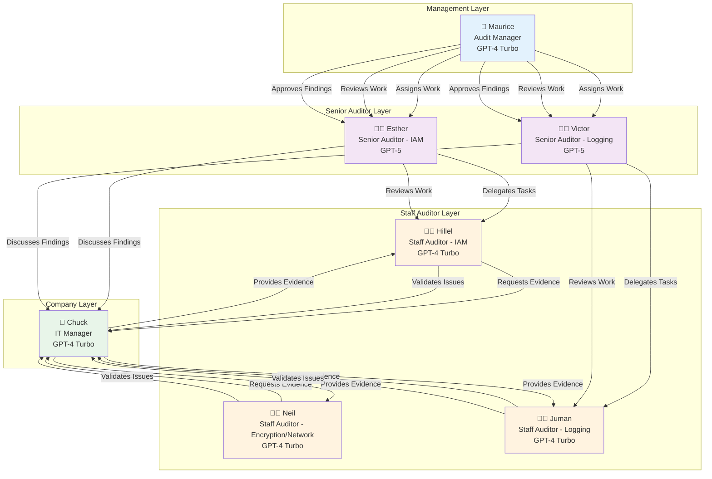

# Agent Collaboration & Communication Patterns

## 🤝 How Agents Work Together



---

## 📊 Communication Patterns

### Pattern 1: Hierarchical Review

```
┌─────────────────────────────────────────────────────────────┐
│  STAFF AUDITOR → SENIOR AUDITOR → AUDIT MANAGER             │
└─────────────────────────────────────────────────────────────┘

Step 1: Staff Auditor completes work
   ↓
   Hillel: "I've completed testing of IAM password policy control.
            Workpaper WP-IAM-001 is ready for review."
   
Step 2: Senior Auditor reviews
   ↓
   Esther: "Reviewing WP-IAM-001... Evidence is sufficient but 
            analysis needs more detail on risk implications.
            Please revise section 3."
   
Step 3: Staff Auditor revises
   ↓
   Hillel: "Revised WP-IAM-001 with expanded risk analysis.
            Ready for re-review."
   
Step 4: Senior Auditor approves
   ↓
   Esther: "WP-IAM-001 approved. Forwarding to Maurice for 
            final review and finding approval."
   
Step 5: Audit Manager reviews
   ↓
   Maurice: "Reviewed WP-IAM-001. Finding is legitimate and 
             well-supported. Approved as official finding."
```

### Pattern 2: Evidence Request

```
┌─────────────────────────────────────────────────────────────┐
│  AUDITOR → COMPANY REP → AUDITOR                            │
└─────────────────────────────────────────────────────────────┘

Step 1: Auditor requests evidence
   ↓
   Hillel: "Hi Chuck, I'm testing the IAM password policy control.
            Can you provide:
            1. Current password policy settings
            2. List of all IAM users
            3. MFA status for each user
            4. Last password change dates"
   
Step 2: Company rep provides evidence
   ↓
   Chuck: "Hi Hillel, here's the requested evidence:
           - Password policy: 12 char min, complexity required
           - 47 IAM users (see attached list)
           - MFA enabled: 42 users, Not enabled: 5 users
           - Password ages: see attached report
           
           Note: The 5 users without MFA are service accounts."
   
Step 3: Auditor follows up
   ↓
   Hillel: "Thanks Chuck. Can you clarify the service account
            exception? Is there a documented policy for this?"
   
Step 4: Company rep clarifies
   ↓
   Chuck: "Yes, we have a documented exception for service accounts
           that use access keys instead of passwords. See attached
           policy document."
```

### Pattern 3: Issue Validation

```
┌─────────────────────────────────────────────────────────────┐
│  AUDITOR → COMPANY REP → AUDITOR                            │
└─────────────────────────────────────────────────────────────┘

Step 1: Auditor identifies issue
   ↓
   Hillel: "Chuck, I've identified a potential issue:
            5 IAM users have not changed passwords in over 90 days,
            which exceeds the company's 60-day policy.
            
            Can you verify these facts?"
   
Step 2: Company rep validates
   ↓
   Chuck: "Confirmed. Those 5 users are contractors who haven't
           logged in recently. We should have disabled them.
           This is a valid finding."
   
Step 3: Auditor documents
   ↓
   Hillel: "Thanks for confirming. I'll document this as a finding
            in the workpaper with your validation."
```

### Pattern 4: Remediation Planning

```
┌─────────────────────────────────────────────────────────────┐
│  SENIOR AUDITOR → COMPANY REP → SENIOR AUDITOR              │
└─────────────────────────────────────────────────────────────┘

Step 1: Senior presents findings
   ↓
   Esther: "Chuck, we've completed testing and identified 4 findings:
            1. 5 users without MFA (High Risk)
            2. Overly permissive S3 bucket policy (Medium Risk)
            3. CloudTrail not enabled in 2 regions (High Risk)
            4. No password rotation for service accounts (Low Risk)
            
            Can you develop remediation plans for each?"
   
Step 2: Company rep develops plans
   ↓
   Chuck: "Here are our remediation plans:
           
           Finding 1: Enable MFA for all users
           - Timeline: 2 weeks
           - Owner: Security team
           
           Finding 2: Restrict S3 bucket policy
           - Timeline: 1 week
           - Owner: DevOps team
           
           Finding 3: Enable CloudTrail in all regions
           - Timeline: 3 days
           - Owner: Security team
           
           Finding 4: Implement key rotation policy
           - Timeline: 4 weeks
           - Owner: Security team"
   
Step 3: Senior documents plans
   ↓
   Esther: "Thanks Chuck. I'll document these plans in the audit
            report with your committed timelines."
```

---

## 🎯 Collaboration Principles

### 1. Professional Communication

```
✓ DO:
  • Use clear, professional language
  • Reference specific workpapers and findings
  • Provide context for requests
  • Thank collaborators for their work
  • Be constructive in feedback

✗ DON'T:
  • Use accusatory language
  • Make assumptions without verification
  • Skip validation steps
  • Provide vague feedback
  • Rush through quality checks
```

### 2. Evidence-Based Decisions

```
Every finding must be:
  ✓ Supported by evidence
  ✓ Validated with auditee
  ✓ Reviewed by senior auditor
  ✓ Approved by audit manager
  ✓ Documented in workpaper
```

### 3. Hierarchical Workflow

```
Staff Auditor
   ↓ (submits work)
Senior Auditor
   ↓ (reviews & approves)
Audit Manager
   ↓ (final approval)
Official Finding
```

### 4. Collaborative Problem-Solving

```
Issue Identified
   ↓
Discuss with Auditee
   ↓
Validate Facts
   ↓
Develop Solution Together
   ↓
Document Agreement
```

---

## 📈 Collaboration Metrics

### Quality Indicators

```
✓ First-time approval rate: >80%
✓ Evidence sufficiency: 100%
✓ Finding validation rate: 100%
✓ Remediation plan completion: >90%
✓ Stakeholder satisfaction: High
```

### Efficiency Indicators

```
✓ Average review cycles: <2
✓ Evidence turnaround time: <24 hours
✓ Issue validation time: <48 hours
✓ Remediation plan development: <1 week
```

---

## 🔄 Feedback Loops

### Loop 1: Quality Improvement

```
Staff Work → Senior Review → Feedback → Revision → Approval
                    ↓
              Learning & Improvement
```

### Loop 2: Finding Validation

```
Preliminary Finding → Auditee Validation → Confirmation → Official Finding
                           ↓
                    Mutual Understanding
```

### Loop 3: Remediation Tracking

```
Finding → Remediation Plan → Implementation → Follow-Up → Closure
                    ↓
              Continuous Monitoring
```

---

## 💡 Best Practices

### For Staff Auditors

1. **Request evidence clearly**: Specify exactly what you need
2. **Document thoroughly**: Include all evidence sources
3. **Validate findings**: Always confirm with auditee
4. **Accept feedback gracefully**: Use it to improve
5. **Ask questions**: Don't assume, clarify

### For Senior Auditors

1. **Provide constructive feedback**: Be specific about improvements
2. **Review thoroughly**: Check evidence sufficiency
3. **Mentor staff**: Help them learn and grow
4. **Maintain standards**: Ensure professional quality
5. **Communicate clearly**: Explain reasoning for decisions

### For Audit Manager

1. **Final quality check**: Verify all standards met
2. **Approve judiciously**: Only approve legitimate findings
3. **Maintain consistency**: Apply standards uniformly
4. **Support the team**: Provide guidance when needed
5. **Sign off confidently**: Ensure report is defensible

### For Company Representative

1. **Respond promptly**: Provide evidence quickly
2. **Be transparent**: Share complete information
3. **Validate facts**: Confirm or correct findings
4. **Develop realistic plans**: Commit to achievable timelines
5. **Collaborate constructively**: Work with auditors, not against them

---

**Created**: December 4, 2025  
**Purpose**: Illustrate agent collaboration patterns  
**Audience**: Team members, system designers, stakeholders
