# The 6 Phases of Autonomous Audit Execution

## 📊 Complete Audit Workflow

```mermaid
graph TB
    Start([Start Audit]) --> Phase1[Phase 1: Risk Assessment & Planning]
    
    Phase1 --> P1_1[Esther: Understand Business]
    P1_1 --> P1_2[Esther: Request Company Inventory]
    P1_2 --> P1_3[Chuck: Provide AWS Inventory]
    P1_3 --> P1_4[Esther: Perform Risk Assessment]
    P1_4 --> P1_5{Maurice: Approve?}
    P1_5 -->|No| P1_4
    P1_5 -->|Yes| P1_6[Esther: Create Audit Plan]
    P1_6 --> Phase2
    
    Phase2[Phase 2: Control Testing] --> P2_1[Assign Controls to Auditors]
    P2_1 --> P2_2[Auditor: Meet with Chuck]
    P2_2 --> P2_3[Chuck: Provide Evidence]
    P2_3 --> P2_4[Auditor: Test Controls]
    P2_4 --> P2_5[Auditor: Validate Issues with Chuck]
    P2_5 --> P2_6[Auditor: Complete Workpaper]
    P2_6 --> Phase3
    
    Phase3[Phase 3: Workpaper Review & QA] --> P3_1[Esther/Victor: Review Staff Work]
    P3_1 --> P3_2{Quality OK?}
    P3_2 -->|No| P3_3[Staff: Revise Workpaper]
    P3_3 --> P3_1
    P3_2 -->|Yes| P3_4[Maurice: Review All Workpapers]
    P3_4 --> P3_5{Approve Findings?}
    P3_5 -->|No| P3_3
    P3_5 -->|Yes| Phase4
    
    Phase4[Phase 4: Remediation Planning] --> P4_1[Esther: Present Findings to Chuck]
    P4_1 --> P4_2[Chuck: Develop Remediation Plans]
    P4_2 --> P4_3[Esther: Document Plans & Timelines]
    P4_3 --> Phase5
    
    Phase5[Phase 5: Audit Reporting] --> P5_1[Esther: Draft Audit Report]
    P5_1 --> P5_2[Maurice: Review Report]
    P5_2 --> P5_3{Approve Report?}
    P5_3 -->|No| P5_1
    P5_3 -->|Yes| P5_4[Maurice: Sign Off]
    P5_4 --> P5_5[Maurice & Esther: Closing Meeting]
    P5_5 --> Phase6
    
    Phase6[Phase 6: Follow-Up] --> P6_1[Maurice: Track Remediation]
    P6_1 --> P6_2{All Issues Resolved?}
    P6_2 -->|No| P6_3[Auditor: Follow-Up Testing]
    P6_3 --> P6_1
    P6_2 -->|Yes| End([Audit Complete])
    
    style Phase1 fill:#e3f2fd
    style Phase2 fill:#fff3e0
    style Phase3 fill:#f3e5f5
    style Phase4 fill:#e8f5e9
    style Phase5 fill:#fce4ec
    style Phase6 fill:#f1f8e9
```



---

## 📋 Phase Details

### Phase 1: Risk Assessment & Planning (2-3 weeks)

```
┌─────────────────────────────────────────────────────────────┐
│  INPUTS                                                      │
├─────────────────────────────────────────────────────────────┤
│  • Company business model                                   │
│  • AWS service inventory                                    │
│  • Prior audit findings                                     │
│  • Regulatory requirements                                  │
└─────────────────────────────────────────────────────────────┘
                            ↓
┌─────────────────────────────────────────────────────────────┐
│  ACTIVITIES                                                  │
├─────────────────────────────────────────────────────────────┤
│  1. Esther understands business & AWS environment           │
│  2. Esther requests complete AWS inventory from Chuck       │
│  3. Esther assesses risks across all control domains        │
│  4. Esther calculates risk scores (Likelihood × Impact)     │
│  5. Esther selects 3-5 high-risk controls to test           │
│  6. Maurice reviews and approves control selection          │
│  7. Esther creates audit plan with assignments              │
└─────────────────────────────────────────────────────────────┘
                            ↓
┌─────────────────────────────────────────────────────────────┐
│  OUTPUTS                                                     │
├─────────────────────────────────────────────────────────────┤
│  ✓ Risk Assessment Workpaper (WP-RISK-001)                 │
│  ✓ Approved control selection (3-5 controls)               │
│  ✓ Audit Plan with assignments (WP-PLAN-001)               │
└─────────────────────────────────────────────────────────────┘
```

### Phase 2: Control Testing (3-4 weeks)

```
┌─────────────────────────────────────────────────────────────┐
│  INPUTS                                                      │
├─────────────────────────────────────────────────────────────┤
│  • Approved audit plan                                      │
│  • Control assignments                                      │
│  • ISACA testing procedures                                 │
└─────────────────────────────────────────────────────────────┘
                            ↓
┌─────────────────────────────────────────────────────────────┐
│  ACTIVITIES                                                  │
├─────────────────────────────────────────────────────────────┤
│  1. Auditor meets with Chuck to explain control             │
│  2. Chuck provides requested evidence                       │
│  3. Auditor performs testing procedures                     │
│  4. Auditor collects additional evidence via AWS APIs       │
│  5. Auditor identifies control weaknesses                   │
│  6. Auditor validates issues with Chuck                     │
│  7. Auditor completes workpaper with findings               │
└─────────────────────────────────────────────────────────────┘
                            ↓
┌─────────────────────────────────────────────────────────────┐
│  OUTPUTS                                                     │
├─────────────────────────────────────────────────────────────┤
│  ✓ Control testing workpapers (one per control)            │
│  ✓ Evidence packages with proper documentation             │
│  ✓ Preliminary findings (not yet official)                 │
└─────────────────────────────────────────────────────────────┘
```

### Phase 3: Workpaper Review & QA (1-2 weeks)

```
┌─────────────────────────────────────────────────────────────┐
│  INPUTS                                                      │
├─────────────────────────────────────────────────────────────┤
│  • Completed workpapers from staff auditors                 │
│  • Evidence packages                                        │
│  • Preliminary findings                                     │
└─────────────────────────────────────────────────────────────┘
                            ↓
┌─────────────────────────────────────────────────────────────┐
│  ACTIVITIES                                                  │
├─────────────────────────────────────────────────────────────┤
│  1. Senior auditor reviews staff workpapers                 │
│  2. Senior checks evidence sufficiency                      │
│  3. Senior verifies analysis supports conclusions           │
│  4. Staff revises workpapers if needed                      │
│  5. Maurice reviews all approved workpapers                 │
│  6. Maurice validates findings are legitimate               │
│  7. Maurice approves issues as official findings            │
└─────────────────────────────────────────────────────────────┘
                            ↓
┌─────────────────────────────────────────────────────────────┐
│  OUTPUTS                                                     │
├─────────────────────────────────────────────────────────────┤
│  ✓ Quality-assured workpapers                              │
│  ✓ Official findings (Maurice approved)                    │
│  ✓ Evidence hierarchy properly applied                     │
└─────────────────────────────────────────────────────────────┘
```

### Phase 4: Remediation Planning (1 week)

```
┌─────────────────────────────────────────────────────────────┐
│  INPUTS                                                      │
├─────────────────────────────────────────────────────────────┤
│  • Official findings from Maurice                           │
│  • Risk ratings for each finding                            │
└─────────────────────────────────────────────────────────────┘
                            ↓
┌─────────────────────────────────────────────────────────────┐
│  ACTIVITIES                                                  │
├─────────────────────────────────────────────────────────────┤
│  1. Esther presents findings to Chuck                       │
│  2. Esther explains risk implications                       │
│  3. Chuck develops remediation plans                        │
│  4. Chuck provides timelines for fixes                      │
│  5. Esther documents plans and commitments                  │
└─────────────────────────────────────────────────────────────┘
                            ↓
┌─────────────────────────────────────────────────────────────┐
│  OUTPUTS                                                     │
├─────────────────────────────────────────────────────────────┤
│  ✓ Remediation plans for each finding                      │
│  ✓ Timeline commitments from Chuck                         │
│  ✓ Documented management responses                         │
└─────────────────────────────────────────────────────────────┘
```

### Phase 5: Audit Reporting (1-2 weeks)

```
┌─────────────────────────────────────────────────────────────┐
│  INPUTS                                                      │
├─────────────────────────────────────────────────────────────┤
│  • All approved workpapers                                  │
│  • Official findings                                        │
│  • Remediation plans                                        │
└─────────────────────────────────────────────────────────────┘
                            ↓
┌─────────────────────────────────────────────────────────────┐
│  ACTIVITIES                                                  │
├─────────────────────────────────────────────────────────────┤
│  1. Esther drafts comprehensive audit report                │
│  2. Esther includes executive summary                       │
│  3. Maurice reviews report for accuracy                     │
│  4. Maurice verifies findings are supported                 │
│  5. Maurice signs off on final report                       │
│  6. Maurice & Esther conduct closing meeting                │
│  7. Management provides signed response letter              │
└─────────────────────────────────────────────────────────────┘
                            ↓
┌─────────────────────────────────────────────────────────────┐
│  OUTPUTS                                                     │
├─────────────────────────────────────────────────────────────┤
│  ✓ Final Audit Report (Maurice signed)                     │
│  ✓ Executive summary                                        │
│  ✓ Management response letter                              │
└─────────────────────────────────────────────────────────────┘
```

### Phase 6: Follow-Up (Optional)

```
┌─────────────────────────────────────────────────────────────┐
│  INPUTS                                                      │
├─────────────────────────────────────────────────────────────┤
│  • Final audit report                                       │
│  • Remediation plans with timelines                         │
└─────────────────────────────────────────────────────────────┘
                            ↓
┌─────────────────────────────────────────────────────────────┐
│  ACTIVITIES                                                  │
├─────────────────────────────────────────────────────────────┤
│  1. Maurice tracks remediation progress                     │
│  2. Maurice requests status updates from Chuck              │
│  3. Auditor performs follow-up testing                      │
│  4. Auditor verifies issues are resolved                    │
│  5. Maurice documents closure                               │
└─────────────────────────────────────────────────────────────┘
                            ↓
┌─────────────────────────────────────────────────────────────┐
│  OUTPUTS                                                     │
├─────────────────────────────────────────────────────────────┤
│  ✓ Follow-up audit report                                  │
│  ✓ Closure confirmation                                    │
│  ✓ Remediation verification                                │
└─────────────────────────────────────────────────────────────┘
```

---

## ⏱️ Timeline Summary

```
Week 1-3:   ████████████ Phase 1: Risk Assessment & Planning
Week 4-7:   ████████████████████ Phase 2: Control Testing
Week 8-9:   ████████ Phase 3: Workpaper Review & QA
Week 10:    ████ Phase 4: Remediation Planning
Week 11-12: ████████ Phase 5: Audit Reporting
Week 13+:   ████ Phase 6: Follow-Up (Optional)

Total: 8-12 weeks for complete audit cycle
```

---

## 🎯 Critical Checkpoints

| Phase | Checkpoint | Owner | Requirement |
|-------|-----------|-------|-------------|
| 1 | Risk Assessment Approved | Maurice | 3-5 controls selected, cannot proceed without approval |
| 2 | Evidence Collected | Chuck + Auditor | All requested evidence provided |
| 3 | Workpapers Reviewed | Esther/Victor + Maurice | Issues not official until Maurice approves |
| 4 | Remediation Plans Obtained | Esther + Chuck | Plans with timelines documented |
| 5 | Report Signed Off | Maurice | Not official until Maurice signs |

---

**Created**: December 4, 2025  
**Purpose**: Visual workflow of the 6 audit phases  
**Audience**: Team members, stakeholders, process documentation
